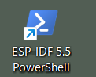
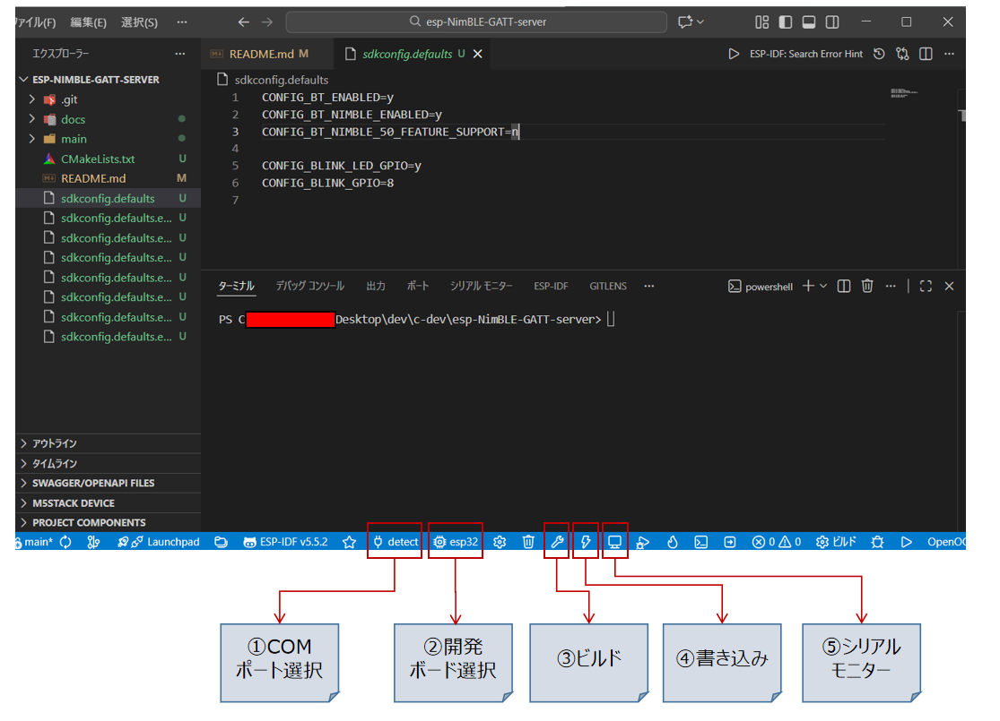
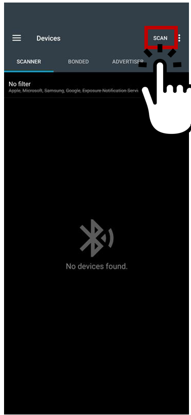
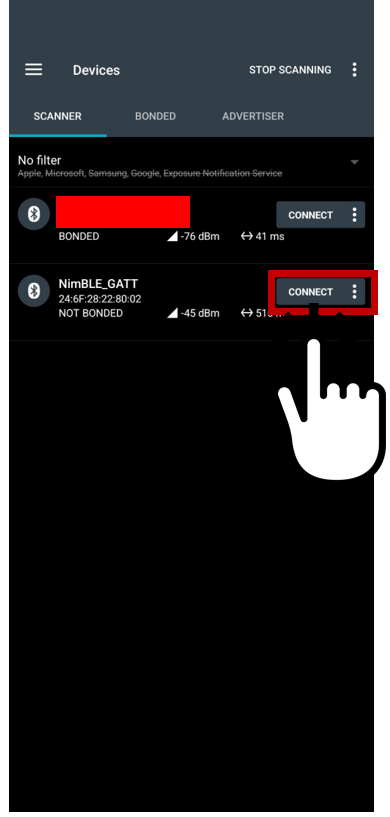
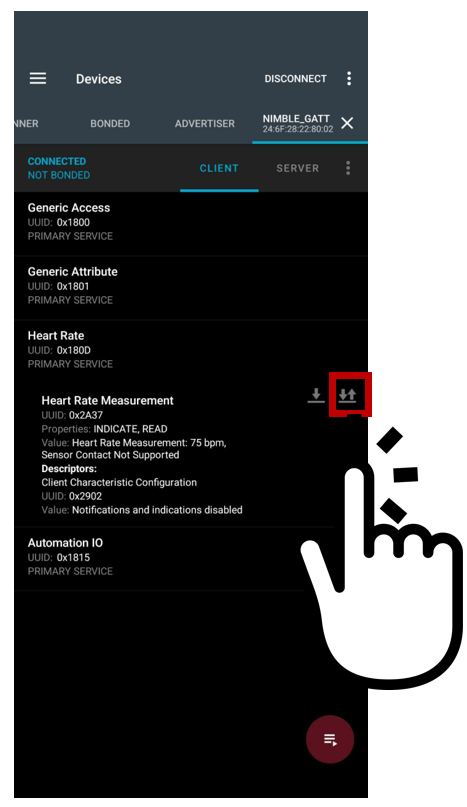
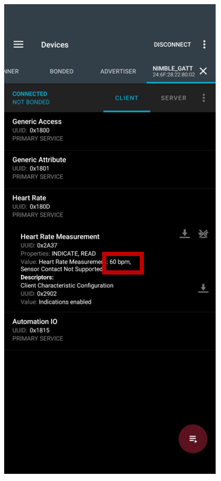

# 概要

本リポジトリは、ESP32 を対象に ESP-IDF(Espressif IoT Development Framework) で`NimBLE`を使用し、`NimBLE_GATT_Server`を実行するまでを記したリポジトリです。
[NimBLE 公式ドキュメント](https://docs.espressif.com/projects/esp-idf/en/stable/esp32/api-reference/bluetooth/nimble/index.html)

## 開発環境

#### PC

- OS: Windows 11 Home (25H2)

#### ESP-IDF

- ESP-IDF: v5.5.2
- インストール方法: ESP-IDF Tools Installer（Windows）
- Python: ESP-IDF 付属

#### Editor

- Visual Studio Code
- Espressif IDF 拡張機能

#### Target

- ESP32-DevKitC-32E

---

### 1. 環境構築

- 1-1. ESP-IDF のインストール
  公式ページより `ESP-IDF v.5.5.2 - Offline Installer` をダウンロードし、表示内容にしたがってインストールを実施</br>

  - ダウンロードページ
  [https://docs.espressif.com/projects/esp-idf/en/stable/esp32/get-started/windows-setup.html](https://docs.espressif.com/projects/esp-idf/en/stable/esp32/get-started/windows-setup.html)
   <p align="center">
     
    </p>

- 1-2. vscode 拡張機能(ESP-IDF)をインストール
  vscode の拡張機能検索で`ESP-IDF`を検索
  <p align="center">
    
  </p>

  ESP-IDF の config は以下を選択し、事前にインストールしている`ESP-IDF`のパスが選ばれていれば OK。
  <p align="center">
    
  </p>

### 2. プロジェクト作成

#### 今回は ESP-IDF から提供されている example をビルドして書き込みます。

- 2-1. ESP-IDF 5.5 PowerShell の実行
  step1-1 でインストールした際にショートカットをデスクトップに作成していれば、デスクトップに以下のようなアイコンがあります。
  <p align="center">
    
  </p>

- 2-2. 開発ディレクトリへ移動
  ⚠️ 図中の`{Your User Name}`はご自身の環境に合わせて頂きますよう、よろしくお願いいたします。

- 2-3. ESP-IDF サンプルプロジェクトのコピー

```bash
xcopy /e /i $env:IDF_PATH\examples\bluetooth\ble_get_started\nimble\NimBLE_GATT_Server .
```

- 2-4. プロジェクトを VSCode で開く

  - vscode 拡張機能(ESP-IDF)をインストールしていると以下のようなボタンが確認できるようになっています。

    - vscode 画面
    <p align="center">
      
    </p>

- 2-5. 対象プロジェクトをビルドする

  - 2-5-1. 対象のボードを USB に接続する
  - 2-5-2. `COMポート選択`(vscode 画面)ボタンをクリックし、対象の COM port を選択する
  - 2-5-2. `開発ボート選択`(vscode 画面)ボタンをクリックし、対象の 開発ボード を選択する
  - 2-5-2. `ビルド`(vscode 画面)ボタンをクリックし、対象プロジェクトをビルドする

- 2-6. 開発ボードに書き込み

  - `書き込み`(vscode 画面)ボタンをクリックし、開発ボードに書き込みを行う。</br>
    ⚠️ ターミナルに`Connecting...`が表示され次第、開発ボードの基板上の`IO0`ボタンを押す。（ボードによって、書き込み方法に差異あり。）

- 2-7. シリアルモニターで動作確認
  - `シリアルモニター`(vscode 画面)ボタンをクリックすることで、ターミナルにログが表示されます。

### 3. 動作確認

- ESP32 に対して BLE による接続確認は`nRF Connect for Mobile`をおすすめします。
  [https://www.nordicsemi.com/Products/Development-tools/nRF-Connect-for-mobile](https://www.nordicsemi.com/Products/Development-tools/nRF-Connect-for-mobile)
- 3-1. BLE Scan を開始
    <p align="center">
      
    </p>

- 3-2. BLE の接続対象を確認して`CONNECT`を押下する。
    <p align="center">
      
    </p>

- 3-3. デバイスとスマホのデータを送受信するように設定する。
    <p align="center">
      
    </p>

- 3-4. ESP32 -> スマホへデータを受信する様子を確認する
    <p align="center">
      
    </p>

---

### Tips

#### vscode で編集するとき

- includePath などのエラーがでたときは、以下の手順を踏むことで解決する可能性あり。

  - 1. コマンドパレット（ctrl+p）を開く
  - 2. `ESP-IDF: Add vscode configuration folder`を入力してエンター

#### ESP-IDF プロジェクトの設定ファイル

- `idf.py menuconfig` コマンドを使うことで、ビルドのオプションの有効化・無効化を選択する。

```bash
idf.py menuconfig
```

- CPU 周波数の選択(以下から選択可能)
  - default: `160 MHz`
    - 80 MHz
    - 160 MHz
    - 240 MHz

```bash
Component config
 └── ESP System Settings
     └── CPU frequency
```

- FreeRTOS の Tick 周波数(以下から選択可能)
  - default: `100Hz`
    | Tick rate | 1 tick の時間 |
    | --------- | ------------ |
    | 100 Hz | 10 ms |
    | 250 Hz | 4 ms |
    | 1000 Hz | 1 ms |

```bash
Component config
 └── FreeRTOS
     └── Kernel
         └── Tick rate (Hz)
```
