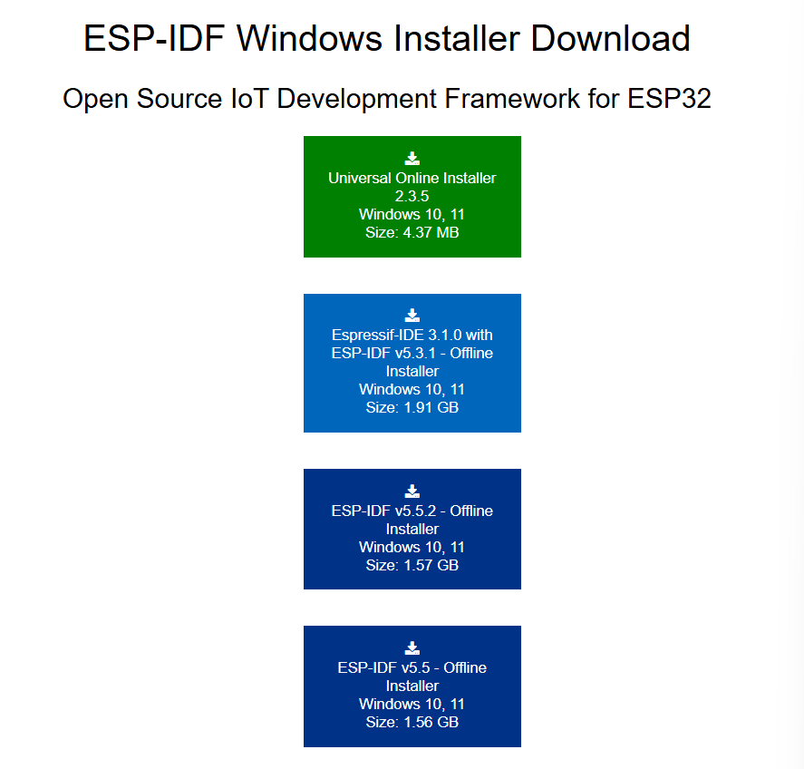
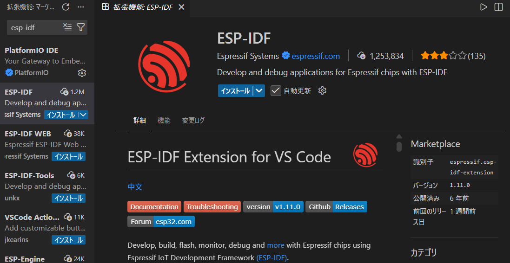
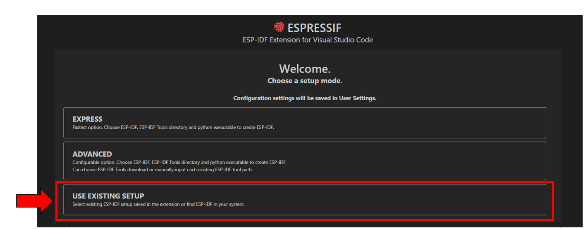

# 概要

本リポジトリは、ESP32 を対象に ESP-IDF(Espressif IoT Development Framework) で`NimBLE`で`NimBLE_GATT_Server`を実行するまでを記したリポジトリです。
[NimBLE 公式ドキュメント](https://docs.espressif.com/projects/esp-idf/en/stable/esp32/api-reference/bluetooth/nimble/index.html)

## 開発環境

#### PC

- OS: Windows 11 Home (25H2)

#### ESP-IDF

- ESP-IDF: v5.5.2
- インストール方法: ESP-IDF Tools Installer（Windows）
- Python: ESP-IDF 付属

#### Editor

- Visual Studio Code
- Espressif IDF 拡張機能

#### Target

- ESP32-DevKitC-32E

---

### 1. 環境構築

- 1-1. ESP-IDF のインストール
  公式ページより `ESP-IDF v.5.5.2 - Offline Installer` をダウンロードし、表示内容にしたがってインストールを実施 

  - ダウンロードページ
    
    [https://docs.espressif.com/projects/esp-idf/en/stable/esp32/get-started/windows-setup.html](https://docs.espressif.com/projects/esp-idf/en/stable/esp32/get-started/windows-setup.html)

- 1-2. vscode 拡張機能(ESP-IDF)をインストール
  vscode の拡張機能検索で`ESP-IDF`を検索
  

  ESP-IDF の config は以下を選択し、事前にインストールしている`ESP-IDF`のパスが選ばれていれば OK。
  

### 2. プロジェクト作成
